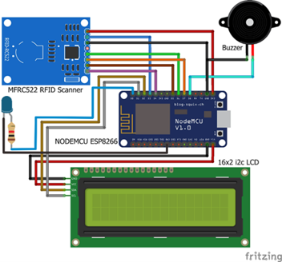

# RFID-Based Automated Attendance System

*An IoT-based student attendance system that uses RFID technology to automatically record attendance, store data in Google Sheets, and deliver real-time WhatsApp notifications.*

## 📌 The Problem

Manual attendance tracking in higher education is time-consuming and highly susceptible to fraud, such as forged signatures or attendance being recorded by another person.

The process also requires lecturers to spend additional time on attendance recapitulation and verification, while providing limited capabilities for real-time attendance monitoring.

## 💡 The Solution

Developed a smart **RFID-based attendance system** using a **NodeMCU ESP8266** microcontroller and an **MFRC522 RFID reader**.

Each student is assigned an RFID card with a unique identifier. When the card is scanned, the NodeMCU reads the RFID data and sends it through an internet connection to **Google Apps Script**.

Google Apps Script processes the attendance data and automatically stores it in **Google Sheets** as a cloud-based database. The system also integrates the **Twilio WhatsApp API** to send real-time attendance notifications containing the student's name, ID, timestamp, and photo directly to the lecturer.

The system workflow consists of:

1. Student scans an RFID card.
2. NodeMCU ESP8266 reads the unique RFID identifier.
3. Attendance data is transmitted through the internet.
4. Google Apps Script processes the received data.
5. Attendance is recorded in Google Sheets.
6. Twilio API sends a WhatsApp notification to the lecturer.

## 🚀 The Impact / Results

* The system successfully records student attendance automatically and stores the data in Google Sheets.
* Attendance data can be recorded in approximately **3 seconds** from RFID card scanning to cloud storage.
* WhatsApp attendance notifications can be delivered in **under 8 seconds**, depending on internet connectivity and network conditions.
* The system provides real-time attendance information to lecturers and reduces manual attendance administration.
* Testing showed that the system could operate normally during repeated scans, although delays or failed data transmission could occur when the internet connection became unstable.

## 📂 Repository Structure

The repository contains the NodeMCU firmware, Google Apps Script integration, RFID card programming code, system wiring documentation, and project diagrams.

```text
rfid-attendance-system/
├── README.md
│
├── images/
│   ├── Activity Diagram.png
│   ├── Attendance Data.png
│   ├── Attendance Device.png
│   ├── Attendance System Use Case.png
│   └── Data sent automatically.png
│
├── schematics/
│   └── system_wiring_diagram.png
│
└── src/
    ├── Apps_Script/
    │   └── Kode.gs
    │
    ├── RFID_Attendance/
    │   └── RFID_Attendance_GoogleSheets.ino
    │
    └── RFID_Card_Name_Tag/
        └── RFID_Card_Name_Tag.ino
```

## 🛠️ Tech Stack

* **NodeMCU ESP8266**
* **MFRC522 RFID Reader**
* **RFID Cards**
* **Google Apps Script**
* **Google Sheets**
* **Twilio WhatsApp API**
* **Arduino IDE**
* **C/C++**
* **I2C LCD Display**
* **Buzzer**
* **LED Indicator**
* **Wi-Fi / Internet**

## 📸 Project Gallery

### Attendance Device

<p align="center">
  
</p>

### Attendance System Use Case

<p align="center">
  
</p>

### Activity Diagram

<p align="center">
  
</p>

### Attendance Data

<p align="center">
  
</p>

### Data Sent Automatically

<p align="center">
  
</p>

### System Wiring Diagram

<p align="center">
  
</p>
